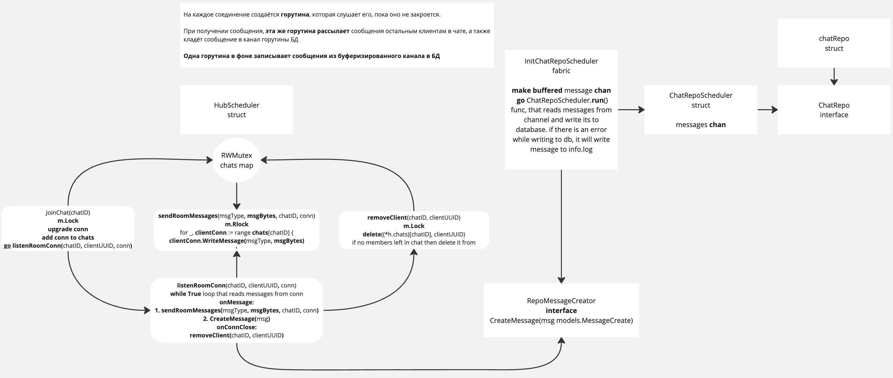

# Simple chat room realisation using websockets
## Предисловие
В этом pet project'e я хотел использовать возможности конкурентого программирования, которые предоставляет язык **Go** 
_(goroutines, channels, mutex)_,использовать популярные в backend'e технологии **Observeability** 
_(Prometheus metrics, Jaeger tracing)_, **Docker, Docker-compose, migrations**, а также реализовать нагрузочное тестирование

## Развёртывание
`cd deploy`  
создайте в этой директории .env, руководствуясь примером .env.example  
`make start`  
все сервисы запущены, миграция к БД автоматически применена.  
в **Makefile** можно ознакомиться с различными стратегиями перезапуска

## Использование
[Prometheus](http://0.0.0.0:9090/)  
[Jaeger](http://0.0.0.0:16686/)  
[Asyncapi websocket docs](http://0.0.0.0:8080/asyncapi)  
[Swagger docs](http://0.0.0.0:8080/swagger/index.html#/)  

[Simple frontend app](http://0.0.0.0:8080/frontend)

## TODOs
- [x] Функциональность
    - [x] Создание чатов
    - [x] Поиск чатов
    - [x] Получение старых сообщений чата по страницам
    - [x] Отправка и получение сообщений через websocket
    - [ ] Аутентификация
    - [ ] Восстановление сообщений при восстановлении соединения с БД
- [x] Benchmark
    - [x] Нагрузочное тестирование
        - [x] Создание N чатов
        - [x] Создание N горутин-слушателей для каждого чата
        - [x] Отправка N сообщений подряд из 1 горутины
        - [x] Отправка N сообщений в K времени
- [x] Observeability
    - [x] Prometheus
        - [x] chat_messages_sent_total counter
        - [x] chat_messages_latency_seconds histogram
        - [x] chats_alive_total gauge
        - [x] users_online_total gauge
        - [x] message_to_db_workers_total gauge
    - [x] Jaeger Tracing

## Логическая схема

## Info
История чата хранится в Postgres, если соединение с postgres пропало, отправляемые сообщения будут записываться в 
info.log файл.
 
Если нет соединения с postgres, не будет возможности получить сообщения, а также присоединиться к чату, даже имея его ID.
